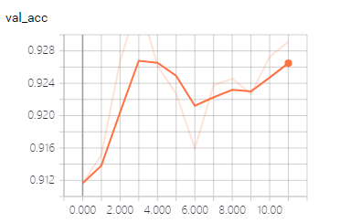

# 走神司机检测

## 脚本

- split_data.py: 划分数据集
- inceptionv3-finetune.py: Inception
- xception-finetune.py: Xception
- resnet50-finetune.py: ResNet
- merge_finetune_model.py: 模型融合
- predict.py: 加载 ResNet 模型进行预测
- merge.py: 直接融合模型进行训练

## 结果




## 其它

- data_analyse: 数据分析
- data_augmentation_test: 数据增强
- *.png: 网络结构


## 主要文件结构

```
imgs/
    train/
        c0/
        c1/
        c2/
        c3/
        c4/
        c5/
        c6/
        c7/
        c8/
        c9/
    test/
data/
    train/
        c0/
        c1/
        c2/
        c3/
        c4/
        c5/
        c6/
        c7/
        c8/
        c9/
    valid/
        c0/
        c1/
        c2/
        c3/
        c4/
        c5/
        c6/
        c7/
        c8/
        c9/
logs/
model/
```

